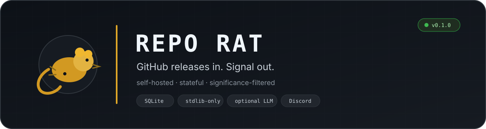
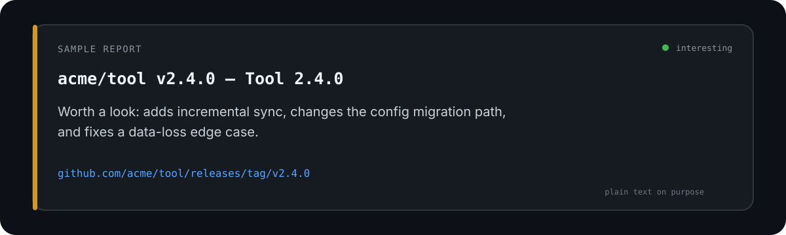
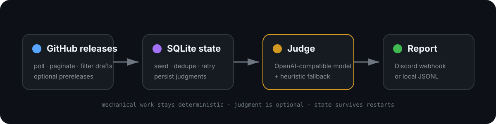

  

  
  
  
  

<strong>A tiny self-hosted release monitor that filters GitHub release noise down to the stuff worth reading.</strong>

Repo Rat watches the repositories you care about, remembers what it has already seen, judges whether a new release is actually noteworthy, and reports the useful ones to Discord or a local JSONL log.

It is deliberately boring infrastructure: **Python 3.11+, SQLite, the GitHub REST API, and zero runtime third-party Python dependencies.** An OpenAI-compatible model can improve the judgment and summaries, but it is optional; a deterministic heuristic judge is always available.

> **Project status:** experimental, usable, and maintained as interest permits.

## At a glance

| | |
| --- | --- |
| **Watch** | Poll any number of public GitHub repositories; drafts are ignored and prereleases are optional. |
| **Filter** | Use an optional OpenAI-compatible judge, with deterministic heuristics as the fallback. |
| **Remember** | Persist baselines, judgments, delivery state, retries, and run history in SQLite. |
| **Deliver** | Post worthwhile releases to Discord, or append structured JSON Lines locally. |

The first normal poll quietly establishes a baseline, so adding a repository with years of releases does **not** detonate your notifications. Explicit `--backfill` is there when you actually want the history.

## Quick start

Clone it, put a few `owner/name` repositories in `config.json`, optionally set a
public GitHub user's starred-repository source, and run one poll:

~~~bash
git clone https://github.com/ClankClub/repo-rat.git
cd repo-rat

# edit config.json, then:
python -m repo_rat --once
~~~

A minimal configuration can be as small as:

~~~json
{
  "repositories": ["python/cpython", "astral-sh/uv"],
  "starred_username": null
}
~~~

To monitor every public repository starred by a GitHub user, set
`starred_username` instead of (or alongside) the explicit list:

~~~json
{
  "repositories": [],
  "starred_username": "silascroe"
}
~~~

The starred source is public-only, paginated, deduplicated with the explicit
list, and optional. A repository newly discovered through stars is quietly
seeded during its first normal poll, so enabling it does not replay years of
old releases. Unstarring a repository stops future checks but does not erase
its remembered release history.

Or install the checkout locally and use the command directly:

~~~bash
python -m pip install .
repo-rat --once
~~~

`--once` is the default, so `python -m repo_rat` and `repo-rat` also perform one normal poll.

## What a report looks like

  

Discord delivery is intentionally plain text rather than a giant bot embed. The wire format is essentially:

~~~text
acme/tool v2.4.0 — Tool 2.4.0
Worth a look: adds incremental sync, changes the config migration path, and fixes a data-loss edge case.
https://github.com/acme/tool/releases/tag/v2.4.0
~~~

Without a Discord webhook, the same judgment is written to `release-log.jsonl` with the repository, tag, summary, reason, URL, timestamp, and delivery channel.

## How it works

  

The mechanical work stays deterministic. GitHub fetching, first-run seeding, deduplication, retry state, and delivery bookkeeping live in ordinary Python and SQLite. The model—when configured—is used only for the part that benefits from judgment: **is this release interesting, and how should it be summarized?**

If the model is unavailable or not configured, Repo Rat falls back to heuristics rather than becoming a very expensive paperweight.

For the internals, release lifecycle, and delivery semantics, see **[docs/architecture.md](docs/architecture.md)**.

## Run modes

| Mode | Command | Behavior |
| --- | --- | --- |
| One poll | `repo-rat --once` | Fetch, judge, report, exit. This is the default. |
| Watch | `repo-rat --watch` | Poll repeatedly using `poll_interval_seconds`. |
| Backfill | `repo-rat --backfill` | Process releases that were silently seeded during the first normal poll. |

For unattended Linux use, `examples/` includes a systemd service and timer. On Windows, Task Scheduler can run `python -m repo_rat --once` on whatever cadence you want.

## Configuration

The checked-in `config.json` shows every available setting. The useful knobs are:

| Setting | Default | Purpose |
| --- | --- | --- |
| `repositories` | `[]` | GitHub repositories as `owner/name`. |
| `starred_username` | `null` | Also monitor every public repository starred by this GitHub username. |
| `poll_interval_seconds` | `3600` | Delay between polls in `--watch` mode. |
| `include_prereleases` | `false` | Include prereleases in addition to stable releases. |
| `bootstrap_mode` | `"seed"` | Establish the first-run baseline without notifying old releases. |
| `state_path` | `state.db` | SQLite state database. |
| `local_log_path` | `release-log.jsonl` | Local fallback / no-webhook output. |
| `llm.enabled` | `true` | Allow model-assisted judgments when credentials exist. |

Secrets never belong in `config.json`. They are read from environment variables:

~~~bash
export GITHUB_TOKEN="..."
export OPENAI_API_KEY="..."
export OPENAI_BASE_URL="https://api.openai.com/v1"
export REPO_RAT_MODEL="gpt-5-mini"
export DISCORD_WEBHOOK_URL="..."
~~~

- `GITHUB_TOKEN` raises GitHub API limits. Public repositories work without it; the included Actions workflow supplies its built-in token automatically.
- `OPENAI_API_KEY` enables model-assisted significance decisions and summaries.
- `OPENAI_BASE_URL` and `REPO_RAT_MODEL` can point the judge at another OpenAI-compatible endpoint/model.
- `DISCORD_WEBHOOK_URL` enables Discord delivery. Without it, reports go to the JSONL log.

The environment-variable names themselves are configurable.

## GitHub Actions

The repository includes an hourly workflow at
`.github/workflows/repo-rat.yml`. It runs one normal poll, persists
`state.db` back to the repository, and supports a manual `workflow_dispatch`
run with optional backfill. Add `DISCORD_WEBHOOK_URL` as an Actions secret to
enable Discord delivery. `OPENAI_API_KEY` is optional; without it, the
deterministic judge still works.

The tracked `config.json` intentionally monitors nobody by default. To use
the starred-repositories source in GitHub Actions, add the repository Actions
variable `REPO_RAT_STARRED_USERNAME` with your GitHub username. It is not a
secret; the workflow writes it into a temporary runner-only config file. For
local use, set `starred_username` in your own `config.json` directly.

`state.db` is deliberately committed so scheduled runs retain their baseline.
It contains public release metadata, not credentials. Forks and downloaded
archives include that snapshot; delete `state.db` if you want a completely
fresh local baseline.

## First run, without the notification apocalypse

The first successful **normal** poll for each repository records the releases already present and marks them as seeded. Nothing is reported.

~~~bash
repo-rat --once
~~~

After that baseline exists, normal polls process only newly discovered releases. If you explicitly want the seeded history:

~~~bash
repo-rat --backfill
~~~

This behavior is deliberate. A release monitor should not punish you for installing it.

## Reliability, deliberately

Repo Rat is small, but it takes state seriously:

- Judgments are persisted before delivery, so a webhook failure does not force another model call.
- Failed judgments remain retryable.
- A failure in one repository does not prevent the others from being checked.
- A SQLite-backed poll lock prevents overlapping local invocations from double-processing work.
- Discord failures fall back to the local JSONL log.
- State writes are transactional and survive restarts.

There is one unavoidable exactly-once caveat: if Discord accepts a report and the process dies before the local delivery marker is committed, recovery can send that report again. A client cannot make an external webhook transaction atomic by sheer force of personality.

## Development

The test suite uses temporary directories and fake HTTP clients. It requires no GitHub, Discord, or model credentials:

~~~bash
python -m unittest discover -s tests -v
~~~

CI runs the suite and a CLI smoke test on Python 3.11, 3.12, and 3.13.

## License

MIT. See [LICENSE](LICENSE).

---

Built as a small experiment in agent-assisted software development.
